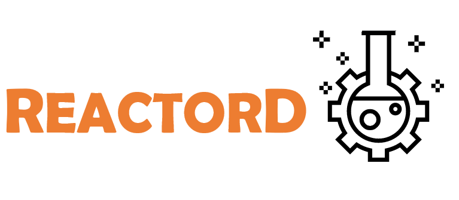

.. ReactorD documentation master file, created by
   sphinx-quickstart on Mon Nov 28 11:57:31 2022.
   You can adapt this file completely to your liking, but it should at least
   contain the root `toctree` directive.

.. title:: ReactorD Documentation

===========

|mybinder| |image1| |image2| |image3| |image4| |image5| |License| |Python 3.7+| |coverage|

.. |mybinder| image:: https://mybinder.org/badge_logo.svg
   :target: https://mybinder.org/v2/gh/SalvadorBrandolin/ReactorD/HEAD
.. |image1| image:: https://api.codeclimate.com/v1/badges/3551471cd4cdf37e226f/maintainability
   :target: https://codeclimate.com/github/SalvadorBrandolin/ReactorD/maintainability
   :alt: Maintanibility
.. |image2| image:: https://github.com/SalvadorBrandolin/ReactorD/actions/workflows/ci.yml/badge.svg
   :target: https://github.com/SalvadorBrandolin/ReactorD/actions/workflows/ci.yml
   :alt: Tests
.. |image3| image:: https://readthedocs.org/projects/reactord/badge/?version=latest
   :target: https://reactord.readthedocs.io/en/latest/?badge=latest
   :alt: Documentation Status
.. |image4| image:: https://camo.githubusercontent.com/69644832889fa9dfcdb974614129be2fda8e4591989fd713a983a21e7fd8d1ad/68747470733a2f2f696d672e736869656c64732e696f2f62616467652f4469536f6674436f6d7043692d46414d41462d666664613030
   :target: https://camo.githubusercontent.com/69644832889fa9dfcdb974614129be2fda8e4591989fd713a983a21e7fd8d1ad/68747470733a2f2f696d672e736869656c64732e696f2f62616467652f4469536f6674436f6d7043692d46414d41462d666664613030
   :alt: DiSoftCompCi
.. |image5| image:: https://img.shields.io/pypi/v/reactord
   :target: https://pypi.org/project/reactord/
   :alt: Pypi
.. |License| image:: https://img.shields.io/badge/License-MIT-blue.svg
   :target: https://tldrlegal.com/license/mit-license
.. |Python 3.7+| image:: https://img.shields.io/badge/python-3.7+-blue.svg
   :target: https://badge.fury.io/py/uttrs
.. |coverage| image:: https://codecov.io/gh/SalvadorBrandolin/ReactorD/branch/main/graph/badge.svg?token=6E0U0F9AYU
   :target: https://codecov.io/gh/SalvadorBrandolin/ReactorD

----

Release
===========
.. rst-class:: release

Ver. |release|

----

**ReactorD** (Reactor Design) is a python package whose proposal is to simulate and design reactors for 
multiple-reaction systems. The intention is to solve the following reactor types in stationary or 
not-stationary conditions: Plug flow (PFR) and Stirred tank (STR) 

According to requirements, the operation settings can change as follows;

- Mass Balance:
   - Homogeneous
   - Heterogeneous
   - Continuous
   - Discontinuous

- Energy Balance:
   - Isothermic
   - Non-isothermic
   - Adiabatic

- Pressure Balance:
   - Isobaric
   - Non-isobaric
     - Packed bed reactor
     - Gas phase reaction

Available in version 0.0.1a2
----------------------------

- Stationary PFR Isothermic - Isobaric Operation
- Stationary PFR Isothermic - Non-isobaric packed bed reactor Operation
- Stationary PFR Adiabatic  - Isobaric Operation
- Stationary PFR Adiabatic  - Non-isobaric packed bed reactor Operation

Motivation
----------
Chemical reaction engineering has as its main objective the study and optimization 
of reactive processes, usually, with a chemical reactor as the protagonist equipment. 
To design a chemical reactor, it is necessary to consider several physical and chemical 
phenomena simultaneously, such as the inlet and outlet molar flow of chemical substances, 
mass transfer, heat transfer, and reaction kinetics. All these contributions to the system's 
complexity, commonly lead to coupled non-linear algebraic problems, coupled differential equations, 
or either both coupled algebraic-differential equations that must be solved by numeric algorithms.
ReactorD provides an interphase to configure the necessary information for the simulation of the chemical reactors. 
Also, ReactorD implements the mathematical representations of mass and energy balances of specific reactors for a numerical resolution.

.. toctree::
   :maxdepth: 1
   :caption: License

   license

.. toctree::
   :maxdepth: 1
   :caption: Tutorials

   installation
   tutorial/index

.. toctree::
   :maxdepth: 1
   :caption: Contents

   modules

.. toctree::
   :maxdepth: 1
   :caption: Modules

Indices and tables
==================

* :ref:`genindex`
* :ref:`modindex`
* :ref:`search`
